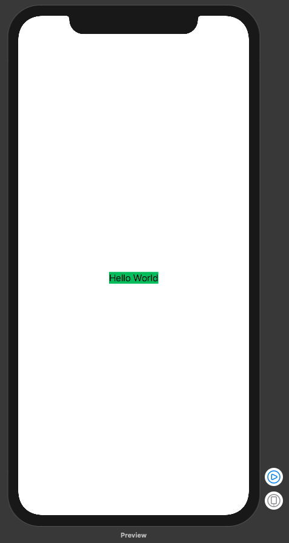
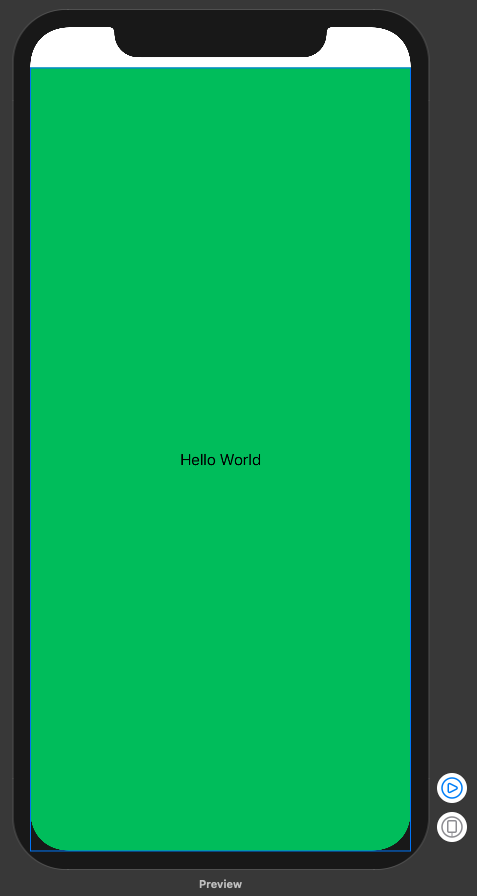

# Set size to full screen

​		Chào các bạn đã quay lại với bài tutorial này của mình. Hôm nay, mình sẽ giải quyết 1 vấn đề nhỏ nhưng khác là nhức đầu cho các bạn mới từ `UIKit` chuyển sang `SwiftUI`. Đó là `set size` cho 1 view bất kì.

### Vấn đề

- Các view trong `SwiftUI` thì chúng được khai báo ra và được add vào các view khác hoặc các hosting
- Kích thước của chúng sẽ phụ thuộc nhiều vào kích thước của view chứa hoặc device hoặc container nào đó
- Bạn có thể sử dụng các function có sẵn như: scale, fix, fill … nhưng chắc chắn là bạn sẽ không thỏa mãn lắm
- Một phần quan trọng thì `SwiftUI` sẽ sử dụng lên nhiều nền tảng nên cái cần thiết bây giờ là quên `UIKit` đi. Mà quên nó là kèm theo 1 đống thứ được gọi là `thói quen` nữa. Ahuhu!

### Bắt đầu thôi!

​		Cái gì cũng có cách giải quyết của nó, *cái khó nó ló cái ngu*. :-)

Chúng ta sẽ bắt đầu với view cơ bản nhất như sau:

```swift
import SwiftUI

struct ContentView : View {
    var body: some View {
        Text("Hello World")
    }
}

#if DEBUG
struct ContentView_Previews : PreviewProvider {
    static var previews: some View {
        ContentView()
    }
}
#endif
```

​		Bạn chú ý cái `ContentView_Previews` đây chính là `container` của view. Và bạn nên nhớ là đó chỉ là `preview` thôi chứ không phải màn hình mà bạn sẽ coding vào.

​		Điều đó có nghĩa là gì?

> Mỗi `struct view` của bạn chỉ làm 1 view đơn giản, nó sẽ:
>
> 1. Được add vào 1 View lớn hơn, nhiều view nhỏ đơn giản sẽ kết hợp thành 1 view lớp phức tạp
> 2. Nó sẽ sử dụng là View của 1 `màn hình`. Lúc xưa là view của **ViewController** . Cái này mới là cái quan tâm chính

​		Tiếp tục với đoạn code thêm background color cho Text của chúng ta với màu xanh lá tuyệt đẹp.

```swift
Text("Hello World")
            .background(Color.green)
```

​		Kết quả trông như thế này :D



​		Bạn chú ý và `màu xanh` thì đó là kích thước của Text lúc đó. Nhiệm vụ của chúng ta rất rõ ràng là phóng to nó ra toàn màn hình và màu xanh sẽ đi theo.

​		Bạn sử dụng đoạn code huyền thoại là:

```swift
.frame()
```

​		Bạn sẽ nhớ tiếp về cách lấy `full screen size` huyền thoại như sau:

```swift
let screenSize: CGRect = UIScreen.mainScreen().bounds
```

​		Nhưng lần này quên đi `UIKit` , vì nếu sử dụng SwiftUI cho MacOS thì đoạn UIKit kia sẽ không hoạt động. Bạn sử dụng tiếp hàng chính chủ như sau:

```swift
.frame(minWidth: Length?, idealWidth: Length?, maxWidth: Length?, minHeight: Length?, idealHeight: Length?, maxHeight: Length?, alignment: Alignment)
```

Với

- `minWidth` sẽ là `0`
- `maxWidth` sẽ là `.infinity,`
- `minHeight` sẽ là `0`
- `maxHeight` sẽ là `.infinity`
- Các tham số tạm thời quên đi

```swift
.frame(minWidth: 0, maxWidth: .infinity, minHeight: 0, maxHeight: .infinity)
```

​		Kết quả sẽ như thế này



​		OK, chúng ta đã hoàn thành một các đơn giản nhất để có thể `full screen`. EZ game <3. Cùng như xem lại toàn bộ code nhóe, ahihi!

```swift
import SwiftUI

struct ContentView : View {
    var body: some View {
        Text("Hello World")
            .frame(minWidth: 0, maxWidth: .infinity, minHeight: 0, maxHeight: .infinity)
            .background(Color.green)
    }
}

#if DEBUG
struct ContentView_Previews : PreviewProvider {
    static var previews: some View {
        ContentView()
    }
}
#endif
```


> Cảm ơn bạn đã theo dõi bài này. Ngoài ra bạn có thể xem thêm video cho nó trực quan sinh động hơn. <3
>
> [https://youtu.be/dI00f5qL0ng](https://youtu.be/dI00f5qL0ng)


---

