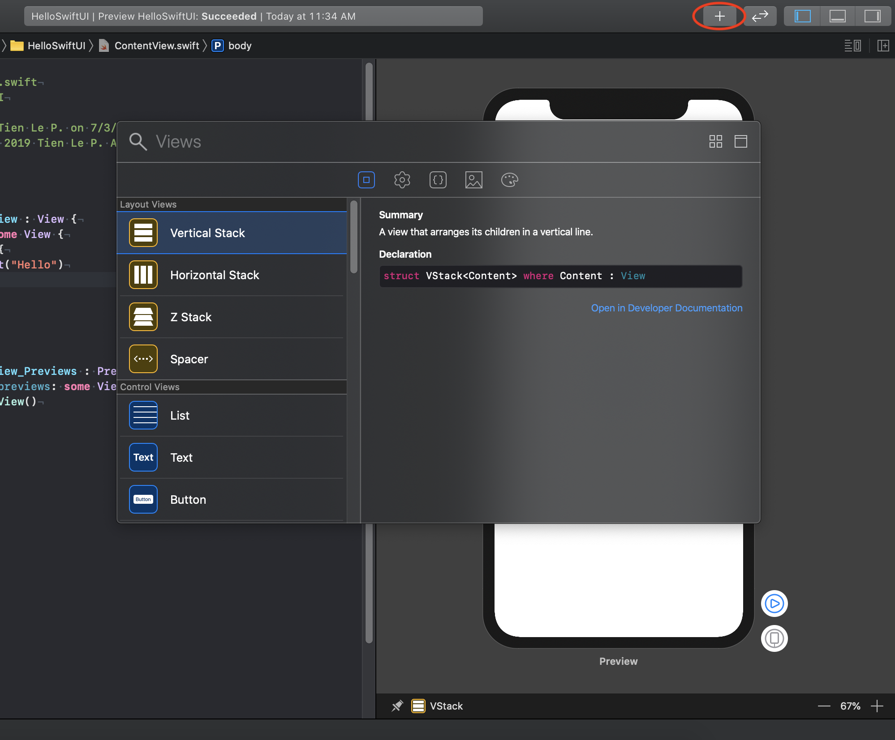
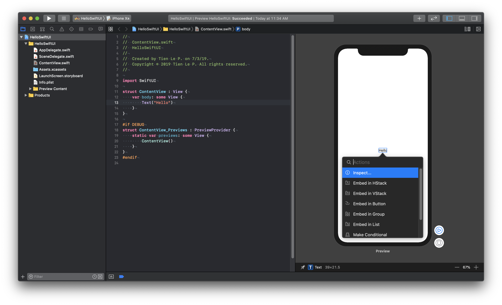
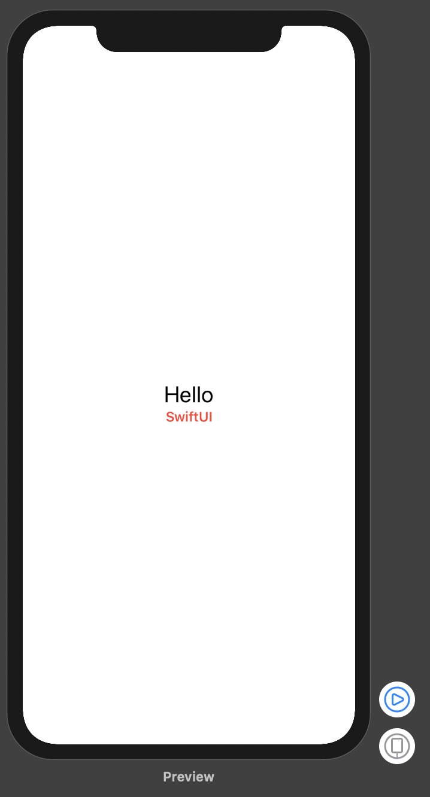

#### [Home](../README.md)
---
# Hello SwiftUI

### 1. Cài đặt

​		Một số lưu ý cho bạn khi bắt đầu bắt tay vào vọc `SwiftUI` là cài đặt môi trường cho nó. Bạn cần chuẩn bị như sau:

- **Xcode 11.0** : hiện tại là bản beta

- **Swift 5.1** : có trong xcode 11.0

- **MacOS 15.0** : hiện tại là bản beta, vì MacOS 15.0 chứa bộ thư viện `UIKit for Mac`, bộ này giúp cho việc hiển thị UI trên MacOS và trên preview của Xcode khi chạy trên MacOS

  Về cài đặt thì bạn chịu khó tải các bản cài đặt trực tiếp từ [Apple Developer](https://developer.apple.com/) để đảm bảo tốt nhất. Sau khi cài đặt xong thì bắt tay vào bài đầu tiên là `Hello SwiftUI`

### 2. New SwiftUI Project

​		Mở Xcode và chọn `new project`


​		Chọn iOS và với application là `single view app`


​		Điền thông tin cho project của mình và quan trọng nhất là chọn `Use SwiftUI`


### 3. Preview

​		Sau khi đã tạo xong project với SwiftUI thì bạn có thể xem qua một chút về giao diện của Xcode (dành cho các bạn mới bắt đầu với iOS). Trong này có 1 phần quan trọng là `Preview`


​	*Trong đó:*

1. **Phần navigation** : trỏ tới các file của project
2. **Phần coding** : bạn sẽ code vào đó
3. **Preview** : nơi giao diện của bạn hiển thị trực tiếp, bạn code tới đâu thì nó sẽ hiện tới đó


​		Về **Preview**, thì đây:

- Là nơi hiển thị giao diện của SwiftUI
- Bạn có thể edit trực tiếp từ nó và code tự động sinh ra bên kia và ngược lại
- Có thể custom kích thước, device hiển thị và hiển thị nhiều device
- Bạn kích vào nút **Resume** để load lại preview


### 4. Coding

​		Xem qua sơ 1 vòng về code của file `ContentView.swift`

```swift
import SwiftUI

struct ContentView : View {
    var body: some View {
        Text("Hello world")
    }
}

#if DEBUG
struct ContentView_Previews : PreviewProvider {
    static var previews: some View {
        ContentView()
    }
}
#endif

```

- Có 2 struct

  - **ContentView** : là view hiển thị của mình
  - **ContentView_Preview** : chứa nội dụng hiển thị cho preview, cái này không bắt buộc phải có cũng được,

- **body** : là nội dung chính của phần View

- some View : kiểu `opaque` bạn nên đọc thêm về nó chút, còn ý nghĩa nôm na có 1 thèn nào đó có kiểu thuộc dòng họ `View` là được

  

  Tiến hành edit chút và xem bên preview để thấy kết quả ngay tức thì

```swift
struct ContentView : View {
    var body: some View {
        Text("Hello")
    }
}
```

### 5. Kéo thả UI

​		Xcode hỗ trợ bạn rất nhiều trong việc coding và kéo thả UI. Với Xcode 11.0 thì bạn có thể kéo thả trực tiếp UI vào code. 

​		Nhấn nút `+` và kéo UI vào code thôi.




​		Nút `Command` thần thánh

- Nhấn `Command` + click chuột để edit UI hoặc thêm các UI khác
  - Vào đoạn code
  - Vào UI trong Preview



### 6. Cú pháp SwiftUI

​		SwiftUI sử dụng thêm cú pháp `declarative`. Nó

- Được sử dụng trong họ hàng nhà `Reactive`
- Tư tưởng lập trình khai báo
- Đơn giản hóa đi rất nhiều các thao tác rườm rà
- Chúng kéo hợp với nhau liên tiếp

Ví dụ: text màu đỏ và font là *headline*

```swift
Text("SwiftUI")
                .color(.red)
                .font(.headline)
```

​		Quay lại project thì chúng ta tiếp tục với đoạn code sau

```swift
struct ContentView : View {
    var body: some View {
        VStack {
            Text("Hello")
                .font(.title)
            Text("SwiftUI")
                .color(.red)
                .font(.headline)
        }
    }
}
```

- Với `declarative` thì

  - Khai báo 1 lần và các thao tác cũng như hiển thị sẽ tiếp tục sử dụng. Khi có sự thay đổi thì các thuộc tính sẽ tự động cập nhật lại.
  - Bạn cũng không cần vất vả phải xử lý chúng, như: set text, đổi màu … khi có 1 sự kiện nào đó xảy ra

- Với đoạn code trên, thì **body** đã được khai báo với 1 Stack có 2 Text

  - Nó sẽ được hiển thị như khai báo
  - Khi có sự thay đổi cần update lại view thì chúng ta không cần phải set lại các thuộc tính đó mà nó tự động cập nhật
  - Các phần sau mình sẽ giải thích nó kĩ hơn

  




#### Cảm ơn bạn đã theo dõi bài này của mình. Bạn có thể xem lại qua video sau:

> https://youtu.be/NtkF1aIofog


---

