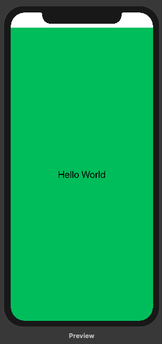
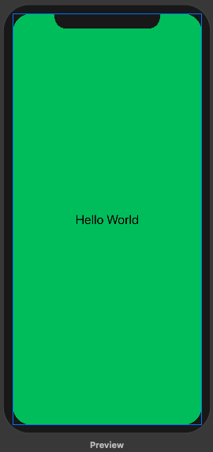

# Outside the SafeArea

​		Chào các bạn đã quay lại với bài tutorial này của mình. Với một số thiết bị của Apple ví dụ như họ hàng nhà iPhone X, XS, XR, XSMAS … thì sẽ có tai thỏ và nút home cảm ứng. Nên giao diện của app sẽ được khống chế bởi `SafeArea`

> Và bạn muốn vượt rào `SafeArea` thì làm như thế nào?

### Vấn đề

```swift
struct ContentView : View {
    var body: some View {
        Text("Hello World")
            .font(.title)
            .frame(minWidth: 0, maxWidth: .infinity, minHeight: 0, maxHeight: .infinity)
            .background(Color.green)
    }
}
```

​		Đoạn code trên rất dễ hiểu, để làm full 1 View lên toàn màn hình và không bị giới hạn kích thước theo từng loại device. Và đây là hình kết quả thu được



​		Cuộc đời vẫn không như là mơ. Lý do phần `SafeArea` đã hạn chế chúng ta. Tương tự như cách chúng ta làm `AutoLayout` trong UIKit, khi mà quên đi việc quan hệ view của mình với supperView là đứa nào.

### Giải pháp

```swift
.edgesIgnoringSafeArea(.all)
```

​		Gọi hàm này thì mọi vấn đề sẽ tan biến. Và chúng ta có thể tùy chọn nhiều kiểu để vượt rào `SafeArea` theo `Edge.Set`

```swift
public static let top: Edge.Set
public static let leading: Edge.Set
public static let bottom: Edge.Set
public static let trailing: Edge.Set
public static let all: Edge.Set
public static let horizontal: Edge.Set
```

​		Hãy tận hưởng kết quả nào =))



​		

​		*Cảm ơn bạn đã đọc và theo dõi bài viết này. Ngoài ra, bạn muốn xem trực quan sinh động hơn thì có thể xem ở link video sau.*

> [https://youtu.be/y-VSar95-S8](https://youtu.be/y-VSar95-S8)

---

