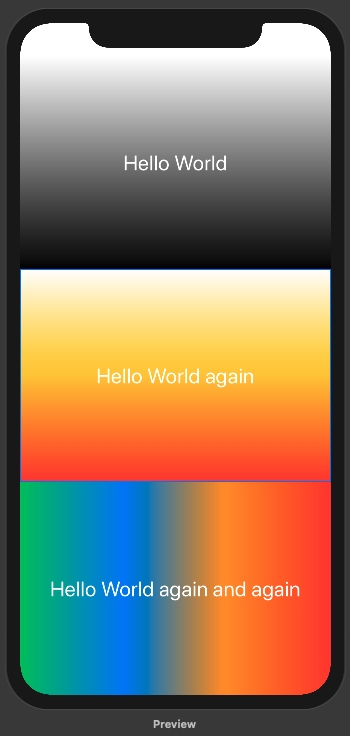
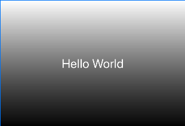
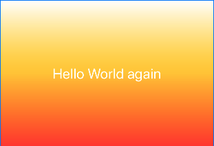
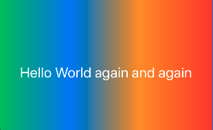

# Render a gradients

​		Chào các bạn đã quay lại với bài tutorial này của mình. Và

> Bây giờ đến với tiết học làm đẹp. Ahihi!

​		Trong giới làm app iOS nói chung thì có rất nhiều kiểu làm đẹp cho app. Trong đó khi nói tới `Gradient` thì hầu như mọi người đều muốn sử dụng `image` có sẵn để tốn công `render` hoặc nó cũng hơi phức tạp một chút.

​		Đây là 3 ví dụ đơn giản trong `SwiftUI` để tạo ra 1 `gradient` một cách nhanh chóng nhất.




### Nguyên tắc

1. Ta set `background` cho View
2. Background ở đây thì có thể từ bất kì thứ nào và với mong muốn `Gradient` thì sử dụng `LinearGradient`
3. Với LinearGradient thì ta lại cần 2 tham số chính
   1. Dãi màu là 1 array `Color`
   2. Vị trí 2 điểm `start` và `end`

### Coding

**Ví dụ 1: Trắng và đen + từ trên xuống dưới**

```swift
LinearGradient(gradient: Gradient(colors: [.white, .black]), startPoint: .top, endPoint: .bottom)
```




**Ví dụ 2: Sử dụng 3 màu "Trắng, Cam, Đỏ"**

```swift
LinearGradient(gradient: Gradient(colors: [.white, .yellow, .red]), startPoint: .top, endPoint: .bottom)
```




**Ví dụ 3: Sử dụng nhiều màu hơn và đi từ phải sang trái**

```swift
LinearGradient(gradient: Gradient(colors: [.green, .blue, .orange, .red]), startPoint: .leading, endPoint: .trailing)
```




**Kết hợp vào background**

```swift
.background(LinearGradient(gradient: Gradient(colors: [.white, .yellow, .red]), startPoint: .top, endPoint: .bottom), cornerRadius: 0)
```


**Full code cho hình trên cùng!**

```swift
struct ContentView : View {
    var body: some View {
        VStack {
            Text("Hello World")
                .frame(minWidth: 0, maxWidth: .infinity, minHeight: 0, maxHeight: .infinity)
                .font(.title)
                .foregroundColor(.white)
                .background(LinearGradient(gradient: Gradient(colors: [.white, .black]), startPoint: .top, endPoint: .bottom), cornerRadius: 0)
            Text("Hello World again")
                .frame(minWidth: 0, maxWidth: .infinity, minHeight: 0, maxHeight: .infinity)
                .font(.title)
                .foregroundColor(.white)
                .background(LinearGradient(gradient: Gradient(colors: [.white, .yellow, .red]), startPoint: .top, endPoint: .bottom), cornerRadius: 0)
            Text("Hello World again and again")
                .frame(minWidth: 0, maxWidth: .infinity, minHeight: 0, maxHeight: .infinity)
                .font(.title)
                .foregroundColor(.white)
                .background(LinearGradient(gradient: Gradient(colors: [.green, .blue, .orange, .red]), startPoint: .leading, endPoint: .trailing), cornerRadius: 0)
        }
    }
}
```


​		*Cảm ơn bạn đã đọc và theo dõi bài viết này. Ngoài ra, bạn muốn xem trực quan sinh động hơn thì có thể xem ở link video sau.*

> [https://youtu.be/TyYJMpwYf1o](https://youtu.be/TyYJMpwYf1o)

---

