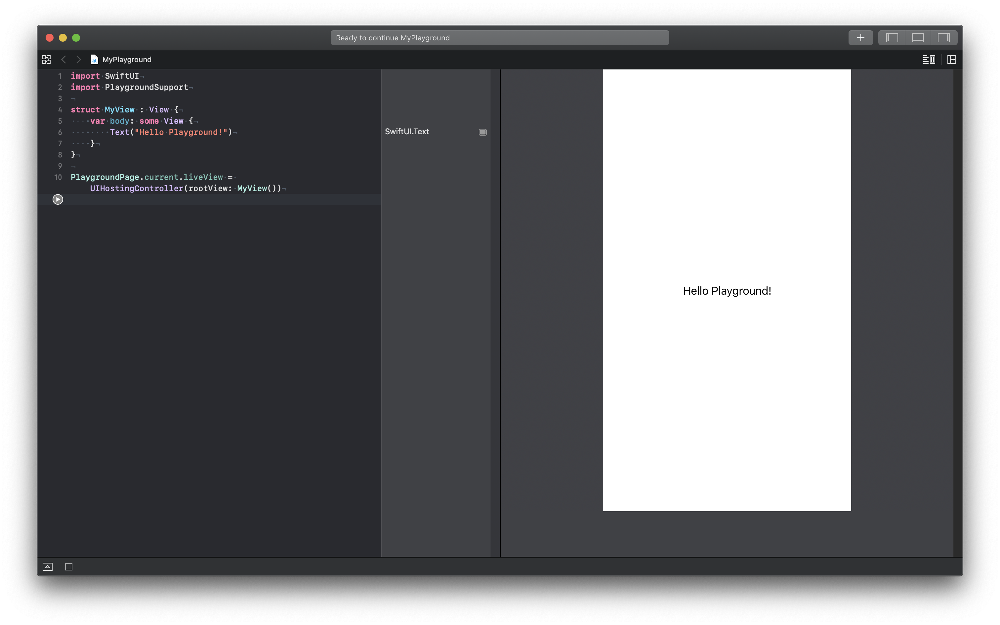

# Run in Playground

> "Cuộc đời vốn không như là mơ."

​	Đối với các bạn lập trình viên thì có được một chiếc `macbook` là 1 chuyện rất khó khăn. Chúng ta tốn 1 đống tiền thì mới mua được. Nhưng với tốc độ phát hành `Swift` và các công nghệ khác thì chiếc macbook của mình sẽ sớm không đủ cấu hình để chạy nữa.

​	Bên cạnh đó, với các bạn thích vọc `SwiftUI` thì cần phải yêu cầu 2 thứ là:

- Xcode 11.0 (beta)
- MacOS 10.15.0 (beta)

Hai thứ này quá nặng, lại thêm với phiên bản `beta` thì việc submit app lên appstore là điều không thể. Kết hợp rất rất nhiều vấn đề lại với nhau thì cần phải chạy được `SwiftUI`  với `MacOS 10.14.x` là điều quan trọng  nhất.

​	`Xcode 11.0 (beta)` chạy tốt trên `MacOS 10.14.5` tuy nhiên để chạy được `SwiftUI` với iOS Project thì không thể được. Tất nhiên, cuộc sống này vốn đã có sự an bài rồi và ông trời không tuyệt đường sống của chúng ta. Chúng ta vẫn có thể chạy `SwiftUI` với MacOS 10.14.5 và trên Xcode 11.x (beta) nhưng trên `Playground` huyền thoại.

​	**Ưu điểm:**

* Học được SwiftUI
* Không lo các bản beta
* Con nhà nghèo vẫn đú theo trend được

​	**Nhược điểm:**

* Chỉ là học thôi, về cú pháp và thao tác
* Single View đơn giản, không kết hợp với nhau được
* Không được mượt và full trải nghiểm như SwiftUI trên iOS Project chính thống được

### 1. Bắt đầu

​	Mở Xcode và tạo `Playground`. Cái này max đơn giản nên mình bỏ qua. `Xóa hết code trong đó` và add đoạn code đầu tiên như sau:

```swift
import SwiftUI
```

​	Đó là quan trọng nhất, ở đây mọi người phải nhớ phân biệt `SwiftUI` nó không liên quan gì tới `UIKit` nữa. Nên bỏ dần đi khái niệm UIKit đi nha.

​	Tiếp theo đó là `view`, bạn thêm đoạn code sau vào tiếp

```swift
struct MyView : View {
    var body: some View {
        Text("Hello Playground!")
    }
}
```

​	Giải thích:

- `struct MyView` kế thừa `protocol View` đó là thành phần chính được dùng trong SwiftUI
- `body` là thuộc tính chính, chính là nội dung view hiển thị
- `some View` là opaque return type

### 2. View in Playground

​	Tiếp tục thêm thư viện nữa, lần này là thêm cho Playground

```swift
import PlaygroundSupport
```

​	Vì chúng ta cần có 1 cái gì đó để hiển thị thể hiện của struct View trên. Tiếp tục nào!

```swift
PlaygroundPage.current.liveView = UIHostingController(rootView: MyView())
```

- Sử dụng `PlaygroundPage` để làm nơi chứa hiển thị
- `UIHostingController` khái niệm mới, nôm na nó là 1 ViewController nhưng không giống như xưa, phần View của nó sẽ được custom ở ngoài và thêm vào.



​	Tới đây thì đã oke cho bạn rồi, có thể `quẩy` vô tư. Các cú pháp khác thì làm như bình thường.

​	Full code nha!

```swift
import SwiftUI
import PlaygroundSupport

struct MyView : View {
    var body: some View {
        Text("Hello Playground!")
    }
}

PlaygroundPage.current.liveView = UIHostingController(rootView: MyView())
```


> Cảm ơn bạn đã theo dõi bài này. Ngoài ra bạn có thể xem thêm video cho nó trực quan sinh động hơn. <3
>
> [https://youtu.be/aud8Uz0ebqM](https://youtu.be/aud8Uz0ebqM)


---

