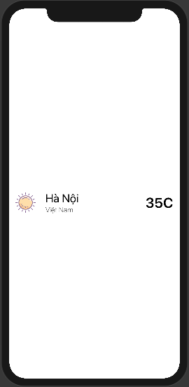
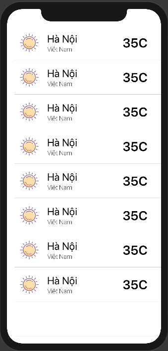
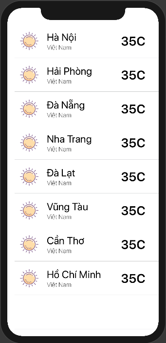

# Custom Row

​		Chào mừng bạn đã tới với bài tiếp theo trong seri nhỏ **Working with List**. Đây là bài tiếp theo của [Simple List](../SimpleList) nên chúng ta thực hiện tiếp project của Simple List.

​		Về giao diện của ứng dụng thì không bao giờ sử dụng các giao diện cơ bản mà chúng cấu tạo nên từ nhiều giao diện cơ bản để tạo thành giao diện phức tạp hơn. Công việc đó được gọi là `Custom Row` hoặc lúc xưa gọi là `Custom Cell` của UITableView.

​		Đây là một công việc quan trọng và cơ bản nhất trong xử lý List. Chúng ta bắt đầu thôi!

### 1. Thiết kế

​		Bài này thì chúng ta sẽ hiển thị danh sách thời tiết của các thành phố. Bắt đầu thì hay tạo thêm 1 file `SwiftUI View`


​		Chú ý chọn chính xác là `SwiftUIView`, sau đó đặt tên file.

​		Tiến hành code giao diện, phần này là code mẫu của mình, bạn có ý tưởng thiết kế gì thì hãy thực hiện nó.

```swift
struct WeatherRow : View {
    var cityName: String
    
    var body: some View {
        HStack {
            Image("sun")
                .padding(.all)
                .frame(width: 80.0, height: 80.0)
                .aspectRatio(contentMode: .fill)
            VStack(alignment: .leading) {
                Text("Hà Nội")
                    .font(.title)
                Text("Việt Nam")
                    .fontWeight(.thin)
            }
            Spacer()
            Text("35C")
                .font(.largeTitle)
                .fontWeight(.bold)
                .multilineTextAlignment(.center)
                .padding(.all)
        }
    }
}
```

​		<u>Chú ý:</u>

* `WeatherRow` là tên của struct View cho Row

* Cấu tạo rất đơn giản bằng việc layout các Text và Image trong Row

* Custom ít thuộc tính của từng đối tượng trong row

  ​	Giao diện của đoạn code trên như sau, ez game :D



​		Bạn đừng quá lo lắng vì với `SwiftUI` thì tất cả đều là các View và chúng được ráp vào nhau nên phần row này mình sẽ ráp vào list của nó.

### 2. Hiển thị View

​		Quay lại file `ContentView.swift` và thay đoạn code sau:

```swift
List(0..<names.count) { index in
            Text(self.names[index])
                .font(.title)
}
```

​		Bằng đoạn code này

```swift
 List(0..<names.count) { index in
            WeatherRow()
 }
```

​		Kết quả như sau:



​		Quá đơn giản. Mình giải thích một chút chỗ này:

* `ContentView` là view hiển thị chính (bạn xem ở file `SceneDelegate.swift` sẽ thấy)
* Bản thân nó trả về 1 `body`
* Body của nó là `List`
* Trong list đó có các `row` chính là các thể hiện của `WeatherRow` mà bạn vừa tạo

### 3. Hiển thị dữ liệu

​		Tiếp theo, chúng ta tìm cách đưa dữ liệu từ danh sách lên view. Dữ liệu cho danh sách như sau:

```swift
let names: [String] = ["Hà Nội",
                           "Hải Phòng",
                           "Đà Nẵng",
                           "Nha Trang",
                           "Đà Lạt",
                           "Vũng Tàu",
                           "Cần Thơ",
                           "Hồ Chí Minh"]
```

​		Về lại file `WeatherRow` 

```swift
struct WeatherRow : View {
    
    var cityName: String
    
    var body: some View {
        HStack {
            Image("sun")
                .padding(.all)
                .frame(width: 80.0, height: 80.0)
                .aspectRatio(contentMode: .fill)
            VStack(alignment: .leading) {
                Text(self.cityName)
                    .font(.title)
                Text("Việt Nam")
                    .fontWeight(.thin)
            }
            Spacer()
            Text("35C")
                .font(.largeTitle)
                .fontWeight(.bold)
                .multilineTextAlignment(.center)
                .padding(.all)
        }
    }
}
```

​		Trong đó:

* `cityName` là 1 property của row để lưu trữ tên thành phố

* `Text(self.cityName)` hiển thị phần dữ liệu lên Text

  Sẽ có một số lỗi của IDE báo, bạn không cần quan tâm nhiều. Tiếp theo là test phần preview của nó. Bạn edit lại `WeatherRow_Previews`

```swift
struct WeatherRow_Previews : PreviewProvider {
    static var previews: some View {
        WeatherRow(cityName: "Hà Nội")
    }
}
```

​		Vì `cityName` chưa được cấp phát giá trị nên lúc khởi tạo row bạn phải cấp phát giá trị cho nó. Và tiến hành edit tiếp bên file `ContentView.swift`

```swift
var body: some View {
        List(0..<names.count) { index in
            WeatherRow(cityName: self.names[index])
        }
    }}
```

​		Kết quả hiện thị như sau:




​		**Xem lại code của các file:**

* `WeatherRow.swift`

```swift
import SwiftUI

struct WeatherRow : View {
    
    var cityName: String
    
    var body: some View {
        HStack {
            Image("sun")
                .padding(.all)
                .frame(width: 80.0, height: 80.0)
                .aspectRatio(contentMode: .fill)
            VStack(alignment: .leading) {
                Text(self.cityName)
                    .font(.title)
                Text("Việt Nam")
                    .fontWeight(.thin)
            }
            Spacer()
            Text("35C")
                .font(.largeTitle)
                .fontWeight(.bold)
                .multilineTextAlignment(.center)
                .padding(.all)
        }
    }
}

#if DEBUG
struct WeatherRow_Previews : PreviewProvider {
    static var previews: some View {
        WeatherRow(cityName: "Hà Nội")
    }
}
#endif
```

* `ContentView.Swift`

```swift
import SwiftUI

struct ContentView : View {
    
    let names: [String] = ["Hà Nội",
                           "Hải Phòng",
                           "Đà Nẵng",
                           "Nha Trang",
                           "Đà Lạt",
                           "Vũng Tàu",
                           "Cần Thơ",
                           "Hồ Chí Minh"]
    
    var body: some View {
        List(0..<names.count) { index in
            WeatherRow(cityName: self.names[index])
        }
    }}

#if DEBUG
struct ContentView_Previews : PreviewProvider {
    static var previews: some View {
        ContentView()
    }
}
#endif
```

**WELL DONE ;)**

​		*Cảm ơn bạn đã đọc và theo dõi bài viết này. Ngoài ra, bạn muốn xem trực quan sinh động hơn thì có thể xem ở link video sau.*

> [https://youtu.be/BjagEGZCKP8](https://youtu.be/BjagEGZCKP8)

---

### Danh sách  [Working with List](../)

---

